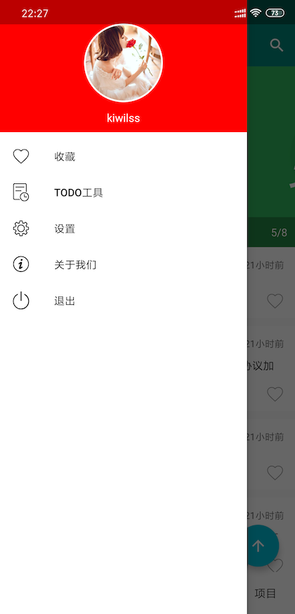

# WanAndroid
采用 kotlin 开发的一款 WanAndroid 客户端


#### 前言
最近刚刚学会 Kotlin，于是趁着有空就用 Kotlin 做了一个小项目，来熟悉一下 Kotlin 语言。。项目地址 [WanAndroid](https://github.com/KiWiLss/WanAndroid/tree/master)，采用了Mvp + Retrofit + Kotlin + LiveData + 协程，仅用于学习交流，如有任何疑问和建议请提 Issues 或联系 qq： 1771050446。

开源不易，如果喜欢的话希望给个 Star 或 Fork ^_^ ，谢谢

#### 参考

在做之前，参考了众多的 WanAndroid 客户端，每个都很优秀。每个用的框架都不同，基本覆盖了常见的框架，如果有需要可以参考，如下：
1. [Awesome-WanAndroid](https://github.com/JsonChao/Awesome-WanAndroid)项目基于Material Design + MVP + Rxjava2 + Retrofit + Dagger2 + GreenDao + Glide
2. [WanAndroid](https://github.com/iceCola7/WanAndroid) 采用 Kotlin 语言编写，结合 MVP + RxJava + Retrofit + Glide + EventBus 等架构设计的项目，项目代码结构清晰并且有详细注释。有 Java 版和 Kotlin 版。
3. [WanAndroid](https://github.com/lulululbj/wanandroid)Kotlin+MVVM+LiveData+协程


#### 预览图



#### API
[WanAndroid API](https://www.wanandroid.com/blog/show/2)

#### 开源框架

[Retrofit](https://github.com/square/retrofit)

[Okhttp](https://github.com/square/okhttp)

[Glide](https://github.com/bumptech/glide)

[moshi](https://github.com/square/moshi)

[BRVH](https://github.com/CymChad/BaseRecyclerViewAdapterHelper)

[AgentWeb](https://github.com/Justson/AgentWeb)

[FlowLayout](https://github.com/hongyangAndroid/FlowLayout)

[VerticalTabLayout](https://github.com/qstumn/VerticalTabLayout)

[Leakcanary](https://github.com/square/leakcanary)

[fastjson](https://github.com/alibaba/fastjson)

[AndroidUtilCode](https://github.com/Blankj/AndroidUtilCode)

[banner](https://github.com/youth5201314/banner)

[AndroidKTX](https://github.com/li-xiaojun/AndroidKTX)

[xpopup](https://github.com/li-xiaojun/XPopup)

#### 下载体验

1. [点击直接下载](http://oss.pgyer.com/4955b1cd485e76d8cab03d8091bd081f.apk?auth_key=1562340100-78016de17becac3ff2f617a67d973a25-0-a58d74f0666461821e95eac8ad0b597a&response-content-disposition=attachment%3B+filename%3Dapp-release.apk)
 2. 扫描下方二维码下载


```
Copyright 2019 kiwilss

Licensed under the Apache License, Version 2.0 (the "License");
you may not use this file except in compliance with the License.
You may obtain a copy of the License at

   http://www.apache.org/licenses/LICENSE-2.0

Unless required by applicable law or agreed to in writing, software
distributed under the License is distributed on an "AS IS" BASIS,
WITHOUT WARRANTIES OR CONDITIONS OF ANY KIND, either express or implied.
See the License for the specific language governing permissions and
limitations under the License.

```